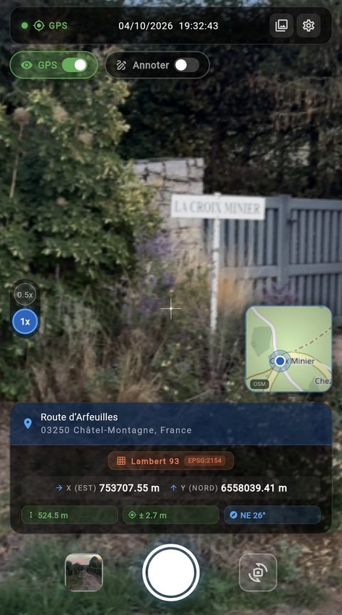
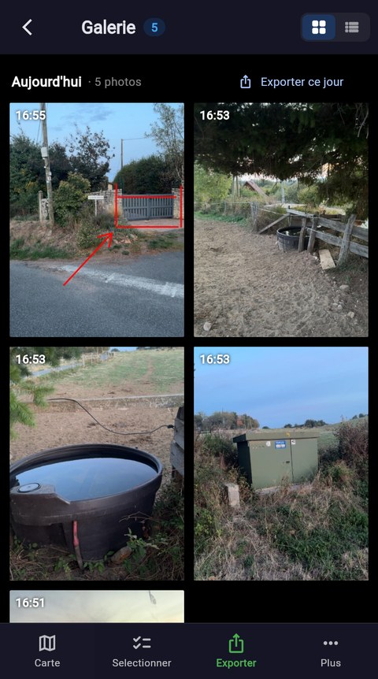
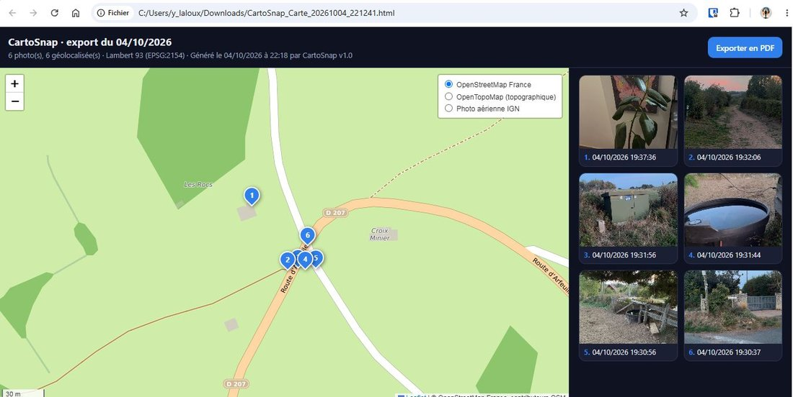
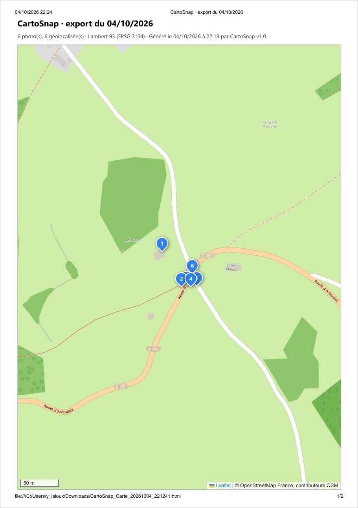
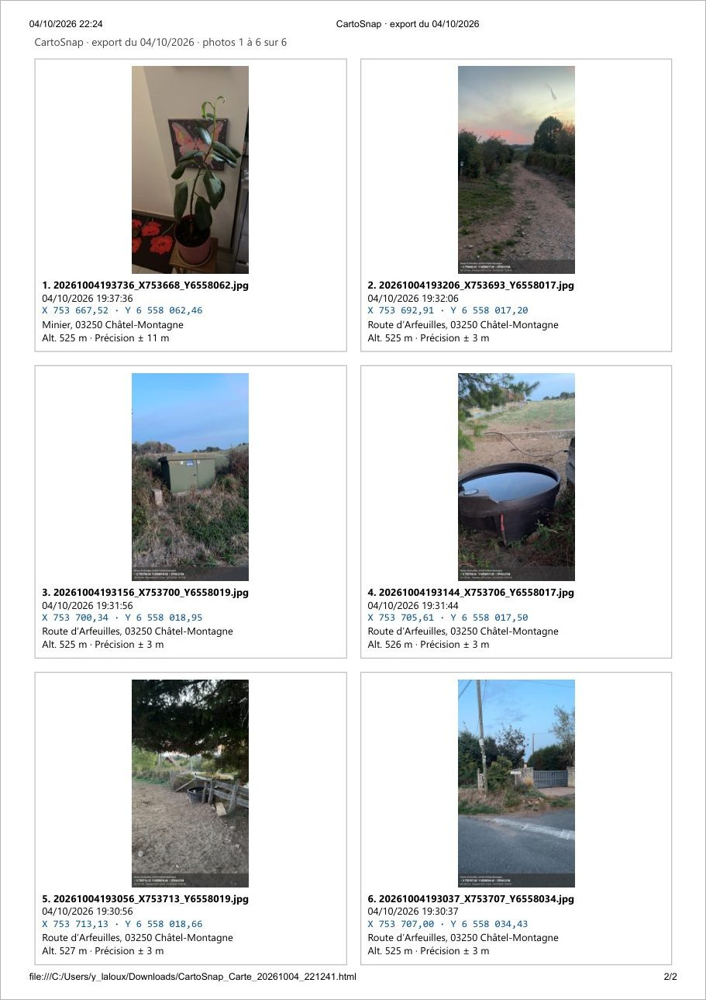

# CartoSnap — version web (iPhone)

**Appareil photo de terrain qui nomme, annote et géoréférence chaque cliché en Lambert 93, utilisable sur iPhone dans Safari**

### [Ouvrir CartoSnap](https://cartoyoyo.github.io/CartoSnap-web/)

---

## Aperçu rapide · Quick Overview

| 1 — Viser | 2 — Annoter | 3 — Retrouver |
|:---:|:---:|:---:|
|  |  |  |
| Position GPS, adresse et X/Y Lambert 93 en direct, mini-carte et objectifs | Stylo 12 couleurs, commentaire ajouté sous la photo | Galerie de l'appli : adresse et date de chaque photo |

| 4 — Vérifier | 5 — Situer | 6 — Exporter |
|:---:|:---:|:---:|
|  |  |  |
| Bandeau incrusté, X/Y, altitude, précision et cap enregistrés | Carte des photos (vignettes) et export JPEG de la carte | CSV, ZIP, projet QGIS ou Carte HTML |

| Résultat : la Carte HTML ouverte dans un navigateur |
|:---:|
|  |
| Un seul fichier `.html` à partager : carte (OSM France, OpenTopoMap, photo aérienne IGN), marqueurs numérotés, coordonnées Lambert 93, photos intégrées et bouton **Exporter en PDF** (A4/A3, portrait/paysage) |

| Exporter en PDF | Rapport — page 1 : la carte | Rapport — page 2 : 6 photos par page |
|:---:|:---:|:---:|
|  |  |  |
| Titre, A4 ou A3, portrait ou paysage | Vue de la carte, marqueurs numérotés, échelle | Photo, date, X/Y Lambert 93, adresse, altitude, précision |

📄 [Voir le rapport PDF d'exemple](docs/exemple_rapport_cartosnap.pdf) (A4 portrait, 2 pages)

---

## Français

### Installer sur iPhone

1. Ouvrez **https://cartoyoyo.github.io/CartoSnap-web/** dans **Safari**.
2. Autorisez la **caméra** et la **position** quand Safari les demande.
3. Touchez **Partager → Sur l'écran d'accueil** : CartoSnap s'ouvre alors en plein écran, comme une application, avec son icône.

Si Safari refuse la position, l'appli affiche un bandeau rouge ; touchez-le pour voir le chemin des réglages (Safari ne permet pas d'ouvrir les Réglages de l'iPhone depuis une page web) :
*Réglages → Confidentialité et sécurité → Service de localisation → Sites Safari → « Lorsque l'app est active » + « Position exacte »*, puis rechargez la page.

### Utilisation

| Étape | Où | Ce qui se passe |
|---|---|---|
| **Viser** | viseur | GPS, adresse, X/Y Lambert 93, altitude, précision et cap en direct ; pastilles à gauche pour changer d'objectif, pincement pour zoomer |
| **Photographier** | bouton central | photo JPEG nommée `AAAAMMJJHHMMSS_X…_Y….jpg`, bandeau de coordonnées incrusté, EXIF GPS |
| **Annoter** | interrupteur « Annoter » | stylo, commentaire, puis *Enregistrer* |
| **Retrouver** | icône galerie | toutes les photos, avec adresse et date ; carte des photos |
| **Exporter** | galerie → ⋮ → *Export CSV / ZIP* | CSV, ZIP photos + CSV, ZIP QGIS, ZIP complet ou **Carte HTML**, puis feuille de partage iOS (Enregistrer, AirDrop, Mail…) |
| **Rapport PDF** | Carte HTML → *Exporter en PDF* | titre, A4 ou A3, portrait ou paysage ; page 1 = la carte, puis 6 photos par page ; *Préparer* puis *Imprimer / Enregistrer en PDF* (iPhone : *Partager → Imprimer*). [Exemple](docs/exemple_rapport_cartosnap.pdf) |

### Exports

| Export | Contenu |
|---|---|
| CSV seul | une ligne par photo : X/Y Lambert 93, date, altitude, adresse, lien Google Maps (UTF-8 avec BOM, `;`) |
| ZIP Photos + CSV | le CSV + les photos |
| ZIP QGIS | GeoJSON Lambert 93 + projet `.qgz`/`.qgs` (photos en vignettes) + photos |
| ZIP Complet | CSV + GeoJSON + projet QGIS + photos |
| **Carte HTML** | un seul fichier `.html` lisible dans tout navigateur : carte (OSM France, OpenTopoMap, photo aérienne IGN), marqueurs, popups avec photo et X/Y, grille des photos |
| **Rapport PDF** | depuis la Carte HTML : titre, A4/A3, portrait/paysage ; page 1 = carte, puis 6 photos par page |
| Carte JPEG | depuis la carte des photos : carte A4 avec vignettes, titre et commentaire |

### À savoir

- **Les photos restent dans Safari**, pas dans la photothèque de l'iPhone. Partagez-les ou exportez-les régulièrement : Safari peut effacer les données d'un site non installé sur l'écran d'accueil.
- **Rien n'est envoyé à un serveur** : les photos de chacun restent sur son téléphone. Seuls l'adresse (Nominatim) et les fonds de carte passent par internet.
- **Sans GPS**, la photo est enregistrée sans coordonnées ; l'appli n'invente jamais de position.
- Sur Android, préférez l'application : [cartoyoyo.github.io/CartoSnap-APK](https://cartoyoyo.github.io/CartoSnap-APK/).
- Différences avec Android (boussole, dossier, réparation) et limites connues : voir la [documentation complète](https://cartoyoyo.github.io/CartoSnap-APK/).

---

## English

CartoSnap is a field camera that names, annotates and geotags every photo in **Lambert 93 (EPSG:2154)**. This repository hosts the **web build** used on iPhone: open [cartoyoyo.github.io/CartoSnap-web](https://cartoyoyo.github.io/CartoSnap-web/) in Safari, allow camera and location, then *Share → Add to Home Screen*. Photos are kept in Safari and exported as CSV, ZIP, QGIS project or a single-file **HTML map** with a **PDF export** button. Android users should install the [APK](https://cartoyoyo.github.io/CartoSnap-APK/).

---

## Contenu du dépôt · Repository content

Ce dépôt ne contient que le résultat de `flutter build web` (fichiers JavaScript versionnés pour éviter le cache) et ce README. Le code source de CartoSnap est privé.

Développé par / Developed by **Yoan Laloux**

*Concept et idée originale par Yoan Laloux — développé avec l'assistance d'outils d'IA générative.*

